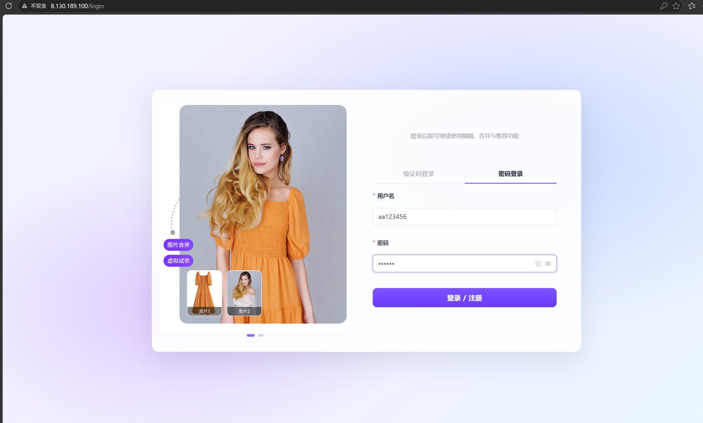
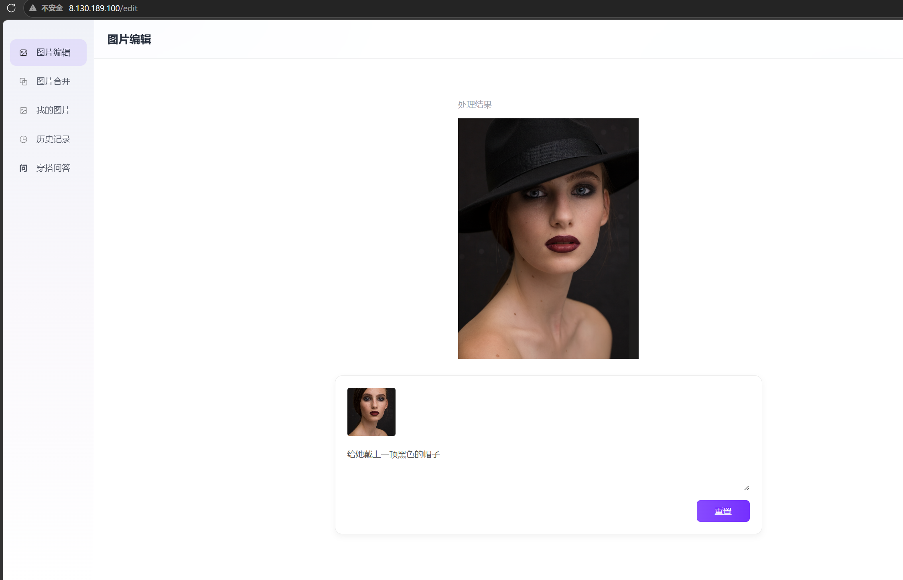
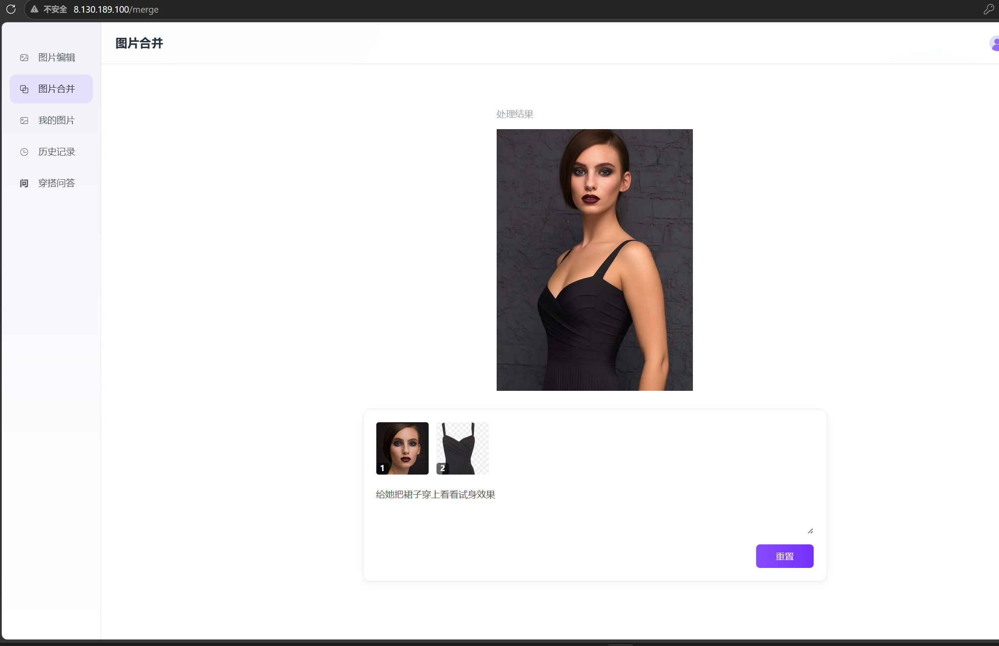
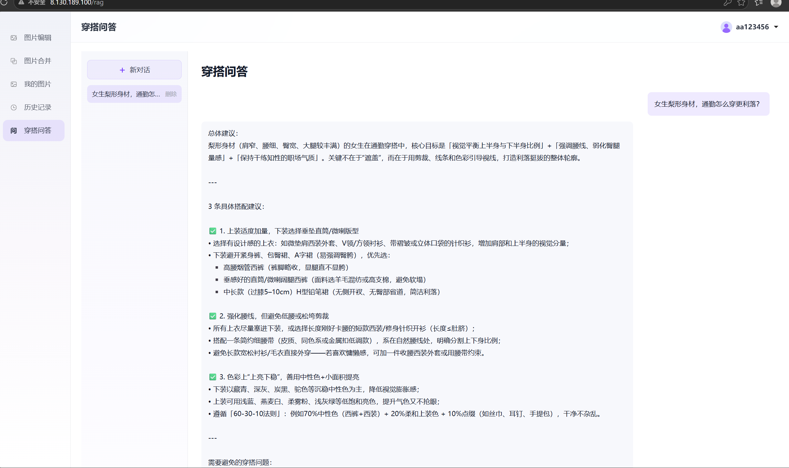
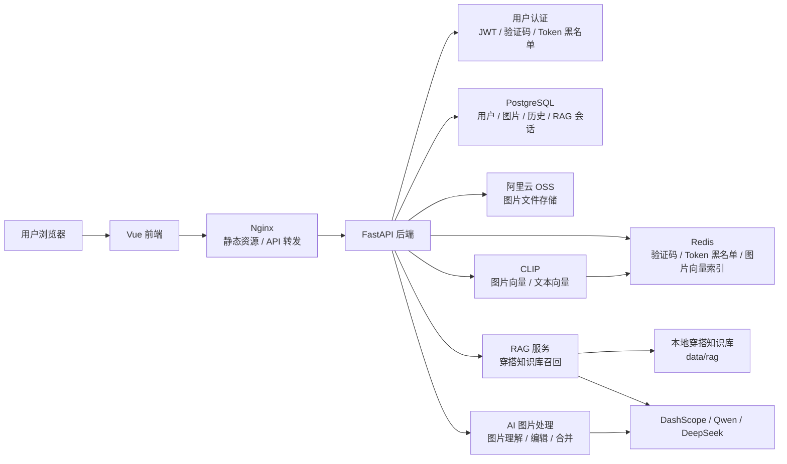
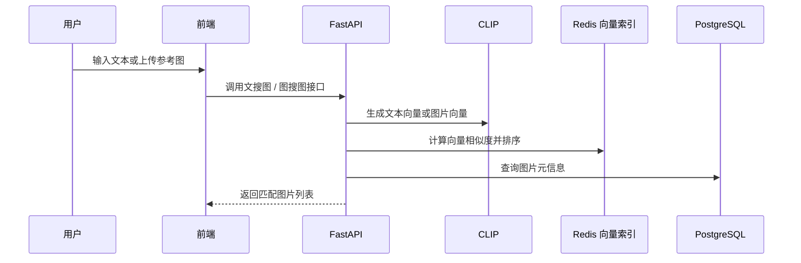

# AIWear 智能穿搭平台

AIWear 是一个面向服装穿搭场景的 AI Web 应用，核心目标是把大模型能力接入真实业务系统。项目重点在 **FastAPI 后端业务、用户认证、图片处理链路、对象存储、CLIP 向量检索、RAG 问答和 SSE 流式输出**，前端页面主要用于功能演示和接口联调。

## 在线演示

```text
http://8.130.189.100
```

项目已部署到云服务器，可直接体验用户登录、图片处理、图片检索和 RAG 穿搭问答等核心功能。

## 项目截图

### 登录与首页



### AI 图片编辑



### 图片合并



### RAG 穿搭问答



穿搭问答页面支持新建会话、历史会话切换、删除会话和连续追问。用户输入穿搭问题后，后端会先从本地穿搭知识库召回相关内容，再调用大模型生成结构化搭配建议，并通过 SSE 逐段流式输出到页面。

## 核心功能

- **用户认证**：邮箱验证码登录 / 注册、JWT 登录状态维护、Redis token 黑名单。
- **图片管理**：图片上传、我的图片、图片操作历史记录。
- **AI 图片处理**：调用 DashScope / 通义万相完成单图编辑和双图合并。
- **图片理解与向量化**：调用 Qwen-VL 生成图片描述，使用 CLIP 生成图片向量。
- **图片检索**：支持文搜图和图搜图，根据向量相似度返回相关图片。
- **RAG 穿搭问答**：基于本地穿搭知识库进行语义召回，结合用户问题、多轮上下文和检索结果生成穿搭建议。
- **多轮会话记忆**：保存用户的穿搭问答历史，支持会话列表、消息回看、新建会话和删除会话。
- **SSE 流式输出**：RAG 问答支持服务端流式返回，页面逐段展示模型输出，减少等待整段回答生成的卡顿感。

## 项目亮点

- **完整业务闭环**：覆盖登录认证、图片上传、AI 图片编辑、图片合并、图片检索、RAG 穿搭问答和历史记录。
- **多模态能力接入**：接入 DashScope / Qwen-VL / 通义万相，实现图片理解、图片编辑和穿搭问答生成。
- **CLIP 向量检索**：对图片和文本生成向量，支持“文搜图”和“图搜图”，让用户可以用自然语言检索自己的素材。
- **RAG 知识库问答**：基于本地穿搭知识库进行语义召回，再结合大模型生成更稳定、更贴近穿搭场景的回答。
- **SSE 流式体验优化**：后端逐块返回回答，前端逐段渲染，避免长时间空白等待或一次性输出造成的割裂感。
- **工程化部署**：使用 Docker Compose 编排 FastAPI、PostgreSQL、Redis、Nginx 和前端静态站点，并已部署到云服务器。

## 技术栈

| 模块 | 技术 |
|---|---|
| 后端 | FastAPI、Pydantic、SQLAlchemy、PyJWT |
| 数据库 | PostgreSQL |
| 缓存 | Redis |
| 文件存储 | 阿里云 OSS / 本地存储 |
| AI 能力 | DashScope、Qwen-VL、通义万相、LangChain |
| 向量检索 | CLIP-ViT-Base-Patch16、Redis |
| 前端演示 | Vue 3、Vite、Element Plus、Pinia、Axios |
| 部署 | Docker、Docker Compose、Nginx |

说明：本项目的主要学习和实现重点是 **后端业务链路、AI 能力接入、RAG、SSE、数据库、Redis、OSS 和部署流程**。前端和 Nginx 主要作为演示页面和部署辅助组件使用。

## 系统架构



## 图片检索流程



## 项目结构

```text
aiwear/
  app/
    api/routes/          FastAPI 接口路由
    core/                配置、数据库、鉴权等基础能力
    models/              SQLAlchemy 数据库模型
    schemas/             Pydantic 请求和响应模型
    services/            业务逻辑
    main.py              后端启动入口
  data/rag/              RAG 穿搭知识库
  fronted/               前端演示页面
  tests/                 后端测试用例
  docker-compose.yml     Docker Compose 部署编排
  Dockerfile.backend     后端镜像构建文件
  requirements.txt       Python 依赖
```

## 核心接口

| 模块 | 路径 | 说明 |
|---|---|---|
| 用户 | `/api/user/send-code` | 发送邮箱验证码 |
| 用户 | `/api/user/auth` | 登录 / 注册 |
| 图片 | `/api/file/upload/image` | 上传图片 |
| 图片 | `/api/file/my-images` | 查询我的图片 |
| 图片 | `/api/file/edit` | AI 图片编辑 |
| 图片 | `/api/file/merge` | AI 图片合并 |
| 检索 | `/api/file/search/text` | 文搜图 |
| 检索 | `/api/file/search/image` | 图搜图 |
| RAG | `/api/rag/status` | 查询知识库导入状态 |
| RAG | `/api/rag/search` | 检索穿搭知识库片段 |
| RAG | `/api/rag/chat/stream` | SSE 流式穿搭问答 |
| RAG | `/api/rag/conversations` | 查询 / 管理穿搭问答会话 |

## 本地运行

项目支持 Docker Compose 一键启动：

```bash
cp .env.example .env
docker compose up -d --build
```

启动后访问：

```text
前端页面：http://localhost
后端文档：http://localhost:8000/docs
健康检查：http://localhost:8000/health
```

真实 `.env` 中包含数据库、Redis、OSS 和模型 API Key 等敏感配置，本仓库仅保留配置模板。

## 演示路线

1. **登录与认证**：展示用户登录，说明 JWT 登录状态、Redis token 黑名单和接口鉴权。
2. **图片上传与管理**：上传图片，说明图片文件存储、图片记录入库和用户素材管理。
3. **AI 图片编辑**：演示单图编辑，例如给人物添加配饰或改变局部效果。
4. **AI 图片合并**：演示人物图与服装图合并，说明 AI 图像生成能力在穿搭场景中的应用。
5. **文搜图 / 图搜图**：用“黑色裙子”等文本检索图片，说明 CLIP 向量化和 Redis 向量索引的作用。
6. **RAG 穿搭问答**：输入穿搭问题，展示知识库召回、多轮会话记忆和 SSE 流式输出效果。
7. **部署结构说明**：简单说明 FastAPI、PostgreSQL、Redis、Nginx、前端和 Docker Compose 的整体关系。

## 后续优化方向

- 使用 Alembic 管理数据库迁移，提升多人协作和生产环境升级的稳定性。
- 将图片向量检索迁移到 PostgreSQL + pgvector 或专业向量数据库，支持更大规模素材检索。
- 将图片向量化、AI 图片处理和知识库导入改成异步任务，提升接口响应速度和系统吞吐量。
