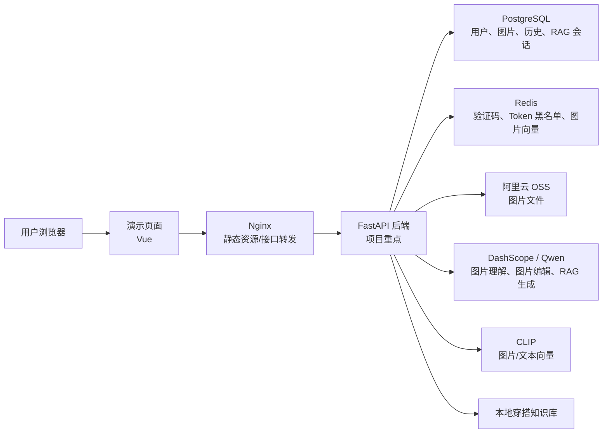

# AIWear 智能穿搭平台

AIWear 是一个面向服装穿搭场景的 AI Web 应用，核心目标是把大模型能力接入真实业务系统。项目重点在 **FastAPI 后端业务、用户认证、图片处理链路、对象存储、CLIP 向量检索、RAG 问答和 SSE 流式输出**，前端页面主要用于功能演示和接口联调。

## 在线演示

```text
http://8.130.189.100
```

项目已部署到云服务器，可直接体验用户登录、图片处理、图片检索和 RAG 穿搭问答等核心功能。

## 项目截图

截图建议放在这里，推荐路径为 `assets/screenshots/`。

<!--
截图放置位置：

### 登录与首页


### 图片上传与我的图片


### AI 图片编辑


### 图片合并


### RAG 穿搭问答

-->

## 核心功能

- **用户认证**：邮箱验证码登录 / 注册、JWT 登录状态维护、Redis token 黑名单。
- **图片管理**：图片上传、我的图片、图片操作历史记录。
- **AI 图片处理**：调用 DashScope / 通义万相完成单图编辑和双图合并。
- **图片理解与向量化**：调用 Qwen-VL 生成图片描述，使用 CLIP 生成图片向量。
- **图片检索**：支持文搜图和图搜图，根据向量相似度返回相关图片。
- **RAG 穿搭问答**：基于本地穿搭知识库，结合用户问题生成穿搭建议。
- **SSE 流式输出**：RAG 问答支持服务端流式返回，页面逐段展示模型输出。

## 技术栈

| 模块 | 技术 |
|---|---|
| 后端 | FastAPI、Pydantic、SQLAlchemy、PyJWT |
| 数据库 | PostgreSQL |
| 缓存 | Redis |
| 文件存储 | 阿里云 OSS / 本地存储 |
| AI 能力 | DashScope、Qwen-VL、通义万相、LangChain |
| 向量检索 | CLIP-ViT-Base-Patch16、Redis |
| 前端演示 | Vue 3、Vite、Element Plus、Pinia、Axios |
| 部署 | Docker、Docker Compose、Nginx |

说明：本项目的主要学习和实现重点是 **后端业务链路、AI 能力接入、RAG、SSE、数据库、Redis、OSS 和部署流程**。前端和 Nginx 主要作为演示页面和部署辅助组件使用。

## 系统架构



## 项目结构

```text
aiwear/
  app/
    api/routes/          FastAPI 接口路由
    core/                配置、数据库、鉴权等基础能力
    models/              SQLAlchemy 数据库模型
    schemas/             Pydantic 请求和响应模型
    services/            业务逻辑
    main.py              后端启动入口
  data/rag/              RAG 穿搭知识库
  fronted/               前端演示页面
  tests/                 后端测试用例
  docker-compose.yml     Docker Compose 部署编排
  Dockerfile.backend     后端镜像构建文件
  requirements.txt       Python 依赖
```

## 核心接口

| 模块 | 路径 | 说明 |
|---|---|---|
| 用户 | `/api/user/send-code` | 发送邮箱验证码 |
| 用户 | `/api/user/auth` | 登录 / 注册 |
| 图片 | `/api/file/upload/image` | 上传图片 |
| 图片 | `/api/file/my-images` | 查询我的图片 |
| 图片 | `/api/file/edit` | AI 图片编辑 |
| 图片 | `/api/file/merge` | AI 图片合并 |
| 检索 | `/api/file/search/text` | 文搜图 |
| 检索 | `/api/file/search/image` | 图搜图 |
| RAG | `/api/rag/chat/stream` | SSE 流式穿搭问答 |

## 本地运行

复制环境变量模板：

```bash
cp .env.example .env
```

使用 Docker Compose 启动：

```bash
docker compose up -d --build
```

启动后访问：

```text
前端页面：http://localhost
后端文档：http://localhost:8000/docs
健康检查：http://localhost:8000/health
```

说明：真实 `.env` 中包含数据库密码、模型密钥、OSS 密钥等敏感信息，本仓库只保留 `.env.example` 和 `.env.docker.example` 作为配置模板。

## 演示顺序

1. 登录系统，说明邮箱验证码、JWT 和 Redis token 黑名单。
2. 上传图片，说明图片文件进入 OSS，并由后端生成图片描述和向量。
3. 演示 AI 图片编辑，例如“给人物加一副黑色眼镜”。
4. 演示图片合并，例如将人物图和服装图进行合并。
5. 演示文搜图或图搜图，说明 CLIP 向量检索的作用。
6. 演示 RAG 穿搭问答，说明知识库召回、上下文记忆和 SSE 流式输出。
7. 简单说明 Docker Compose 如何组织后端、数据库、Redis、前端演示页面和 Nginx。

## 后续优化方向

- 使用 Alembic 管理数据库迁移。
- 将图片向量检索迁移到 PostgreSQL + pgvector 或专业向量数据库。
- 将图片向量化和 AI 图片处理改成异步任务。
- 为 RAG 增加更完整的召回评估和回答质量评估。
